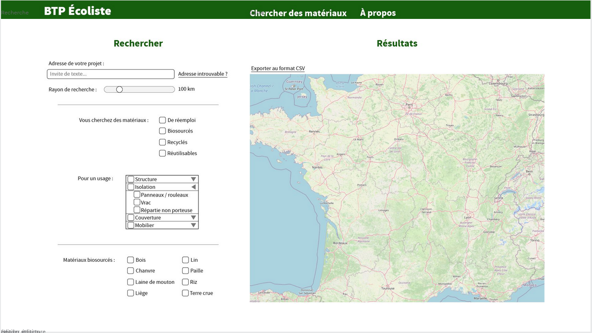
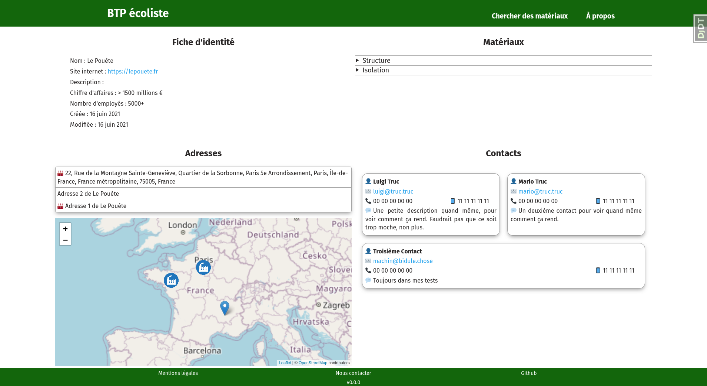
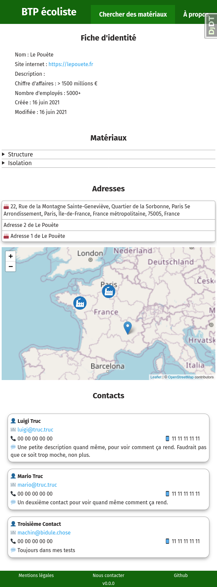
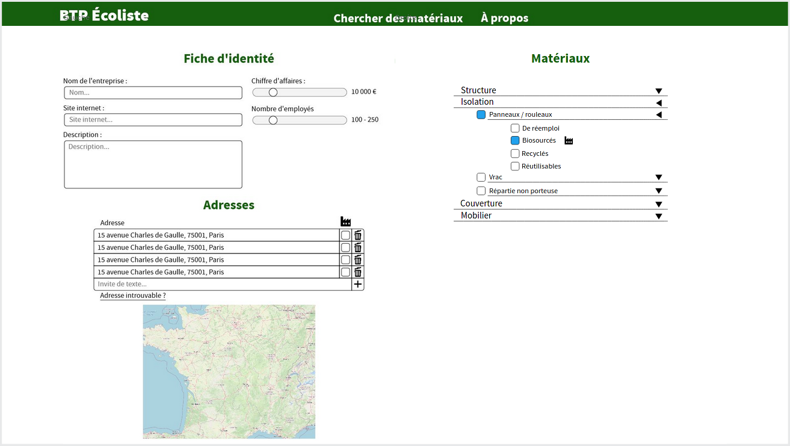

# BTPecoliste

Une application web pour recenser et rechercher des fournisseurs de matériaux de BTP éco-responsables.

Je me base sur mon expérience dans une entreprise de conseil en construction durable pour essayer de fournir l’outil le
plus pratique possible. Il y aura la possibilité de faire une recherche selon la distance par rapport au chantier, et
selon des critères d’usage des matériaux, et de leur provenance (recyclé, occasion, biosourcé).

Il s’agit d’un projet personnel, qui me sert en même temps à apprendre, et j’essaye de bien faire les choses pour qu’il
soit le plus propre possible. Du coup ça avance doucement, et je ne sais pas encore quand il sortira, encore moins quand
il sera réellement utilisable, c’est-à-dire avec des données intéressantes 🙂

## Captures d’écran

Il s'agit de travaux en cours.

Page de recherche - maquette

Actuelle page d’entreprise

Et c’est même responsive !

Page d’administration - maquette

## Technique

Le site est développé avec Django. Il utilise une base de données PostgreSQL et sont extension PostGIS qui lui permet de
gérer des données spatiales. Le front est en HTML/CSS/JS sans framework, sauf Leaflet pour les cartes.